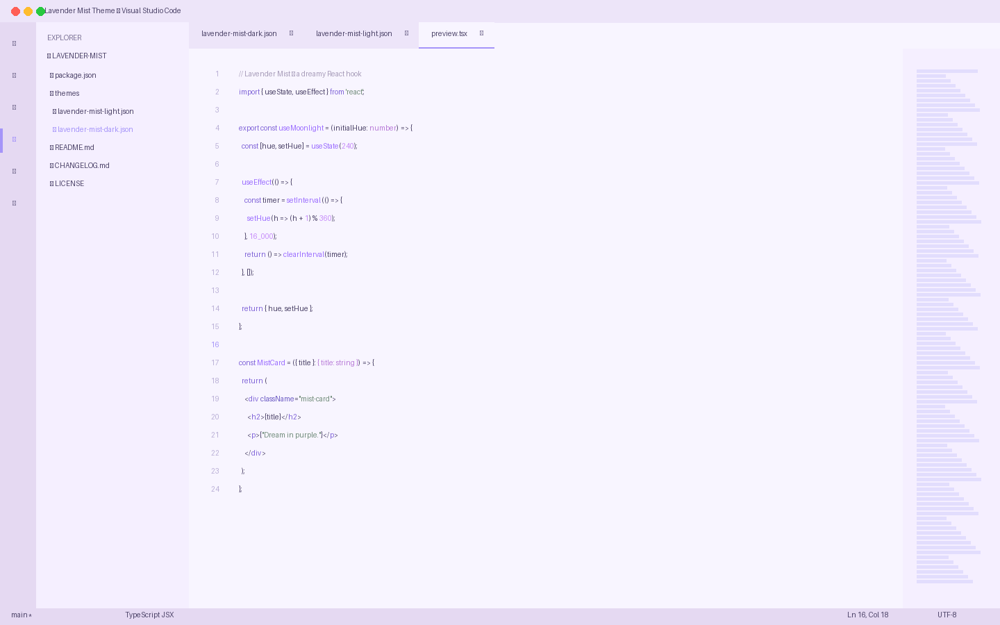
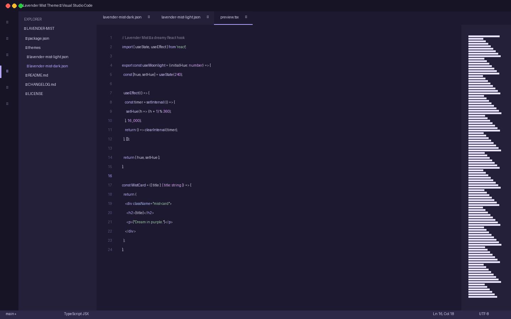

# Lavender Mist Theme

[](https://marketplace.visualstudio.com/items?itemName=lilinhuang.lavender-mist)

A dreamy, soft purple VS Code theme collection — **Lavender Mist Light** and **Lavender Mist Dark**.

Inspired by lavender flowers, purple moonlight, and quiet creative workspaces. Designed for AI developers, frontend engineers, designers, indie hackers, and creative programmers who want a calm, premium coding environment.

> *A quiet lavender night where ideas become digital products.*


## Features

- **Two themes in one extension** — Light & Dark modes
- Dreamy lavender-inspired palette with soft, low-contrast colors
- Eye-friendly for long coding sessions
- Full syntax highlighting for JavaScript, TypeScript, React, JSX, HTML, CSS, JSON, Python, Markdown
- Complete UI theming: editor, activity bar, sidebar, tabs, terminal, git, notifications
- Semantic token highlighting support
- Modern, minimal, premium aesthetic

## Screenshots

### Lavender Mist Light

Soft lavender background for calm morning creativity.



```
editor.background:   #F8F5FF
panel / sidebar:     #F5EFFF
accent:              #A594F9
selection:           #CDC1FF
```

### Lavender Mist Dark

Deep purple night palette for focused moonlight coding.



```
editor.background:   #1D1930
background:          #171525
accent:              #B9A7FF
selection:           #514878
```

## Color Palette

### Light Mode

| Role | Color | Hex |
|------|-------|-----|
| Background | 🌸 mist | `#F8F5FF` |
| Panel / Sidebar | 🌫️ soft fog | `#F5EFFF` |
| Primary Accent | 💜 lavender | `#A594F9` |
| Selection | ✨ highlight | `#CDC1FF` |
| Keywords | 🔑 purple | `#8064D8` |
| Functions | 🎆 violet | `#9B6DFF` |
| Strings | 🌿 sage | `#718C7A` |
| Numbers | 🌙 magenta | `#C58AF9` |

### Dark Mode

| Role | Color | Hex |
|------|-------|-----|
| Background | 🌌 night | `#171525` |
| Editor | 🖥️ deep | `#1D1930` |
| Sidebar | 🌑 dusk | `#24203A` |
| Primary Accent | 💫 moonlight | `#B9A7FF` |
| Selection | 🔮 glow | `#514878` |
| Keywords | 🔑 lilac | `#C7B6FF` |
| Functions | 🎆 pale violet | `#D8C8FF` |
| Strings | 🌿 mint | `#9BC7A5` |
| Numbers | 🌙 soft magenta | `#E0A7FF` |

## Installation

1. Open the Extensions view in VS Code (`Ctrl+Shift+X`)
2. Search for **"Lavender Mist"**
3. Click **Install**
4. Open Command Palette (`Ctrl+Shift+P`) → **Preferences: Color Theme** → select **Lavender Mist Light** or **Lavender Mist Dark**

Or install from the [Visual Studio Marketplace](https://marketplace.visualstudio.com/items?itemName=lilinhuang.lavender-mist).

## Customization

Both themes are fully customizable via VS Code settings:

```jsonc
{
  // Override any color in your settings.json
  "workbench.colorCustomizations": {
    "editor.background": "#F8F5FF",
    "activityBar.background": "#EDE5F9"
  }
}
```

## Supported Languages

Optimized syntax highlighting for:
- JavaScript / TypeScript
- React / JSX / TSX
- HTML / CSS / SCSS
- JSON / YAML
- Python
- Markdown
- And more...

## Part of a Theme Collection

Lavender Mist belongs to a cohesive personal VS Code theme collection:

- [Pastel Pink](https://marketplace.visualstudio.com/items?itemName=lilinhuang.pastel-pink)
- [Olive Dream](https://marketplace.visualstudio.com/items?itemName=lilinhuang.olive-dream)
- [Cozy Latte](https://marketplace.visualstudio.com/items?itemName=lilinhuang.cozy-latte)
- **Lavender Mist**

## Credits

Designed by [Li Lin Huang](https://www.linkedin.com/in/%E4%B8%BD%E9%9C%96-%E9%BB%84-7b7794373/) — inspired by lavender fields at dusk, quiet moonlight, and the creative flow of building digital products.

## License

[Non-Commercial License](LICENSE) — Free for personal, educational, and non-commercial use.
